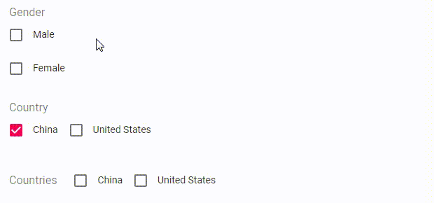

# FormikCheckboxGroupField

## Prop API

|Name|Type|Default|Description|
|---|---|---|---|
|CheckboxProps|`object`||Properties applied to the [@material-ui/core/Checkbox](https://material-ui.com/api/checkbox/) component|
|FormControlLabelProps|`object`||Properties applied to the [@material-ui/core/FormControlLabel](https://material-ui.com/api/form-control-label/) component|
|FormGroupProps|`object`||Properties applied to the [@material-ui/core/FormGroup](https://material-ui.com/api/form-group/) component|
|FormHelperTextProps|`object`||Properties applied to the [@material-ui/core/FormHelperText](https://material-ui.com/api/form-helper-text/) component|
|FormLabelProps|`object`||Properties applied to the [@material-ui/core/FormLabel](https://material-ui.com/api/form-label/) component|
|multiple|`bool`|`false`|Whether to enable multiple selection, if it is `true`, the field value in `initialValues` must be an array|
|name|`string`||The name of the field, see formik docs [field#name](https://jaredpalmer.com/formik/docs/api/field#name)|
|options|`array`||The checkbox list, each of which is an object like `{ label: 'Male', value: 'male' }`, `value` must be unique and can only be a `string`|
|row|`true` or `false` or `all`|`false`|Whether to use the row layout, if it is `all` then all the elements are arranged in a row|
|validate|`func`||Validator, see formik docs [field#validate](https://jaredpalmer.com/formik/docs/api/field#validate)|

Any other properties supplied will be spread to the [@material-ui/core/FormControl](https://material-ui.com/api/form-control/) component.

## Example

<p align="center">
  
</p>

```js
import React, { Component } from 'react';
import { Formik, Form } from 'formik';
import * as Yup from 'yup';
import { FormikCheckboxGroupField } from 'formik-material-fields';

const validationSchema = Yup.object().shape({
  gender: Yup.string().required(),
  country: Yup.string().required(),
  countries: Yup.array().required(),
});

const initialValues = {
  gender: '',
  country: '0',
  countries: [],
};

class MyForm extends Component {
  render() {
    return (
      <Formik
        initialValues={initialValues}
        validationSchema={validationSchema}
        onSubmit={this.props.onSubmit}
      >
        {({ isValid }) => (
          <Form autoComplete="off">
            <FormikCheckboxGroupField
              name="gender"
              label="Gender"
              margin="normal"
              options={[
                { label: 'Male', value: 'male' },
                { label: 'Female', value: 'female' },
              ]}
            />
            <FormikCheckboxGroupField
              name="country"
              label="Country"
              margin="normal"
              options={[
                { label: 'China', value: '0' },
                { label: 'United States', value: '1' },
              ]}
              row
              fullWidth
            />
            <FormikCheckboxGroupField
              name="countries"
              label="Countries"
              margin="normal"
              options={[
                { label: 'China', value: '0' },
                { label: 'United States', value: '1' },
              ]}
              row="all"
              fullWidth
              multiple
            />
          </Form>
        )}
      </Formik>
    );
  }
}

```