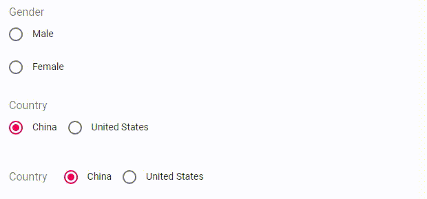

# FormikRadioGroupField

## 道具 API

|名字|类型|默认|描述|
|---|---|---|---|
|FormControlLabelProps|`object`||附加到 [@material-ui/core/FormControlLabel](https://material-ui.com/api/form-control-label/) 上的道具|
|FormHelperTextProps|`object`||附加到 [@material-ui/core/FormHelperText](https://material-ui.com/api/form-helper-text/) 上的道具|
|FormLabelProps|`object`||附加到 [@material-ui/core/FormLabel](https://material-ui.com/api/form-label/) 上的道具|
|name|`string`||字段的名字，见formik文档 [field#name](https://jaredpalmer.com/formik/docs/api/field#name)|
|options|`array`||radio列表，每一项是一个形如`{ label: 'Male', value: 'male' }`的对象，`value`必须唯一，且只能为`string`|
|RadioGroupProps|`object`||附加到 [@material-ui/core/RadioGroup](https://material-ui.com/api/radio-group/) 上的道具|
|RadioProps|`object`||附加到 [@material-ui/core/Radio](https://material-ui.com/api/radio/) 上的道具|
|row|`true` 或 `false` 或 `all`|`false`|是否使用行布局，如果是`all`则所有元素都排列成一行|
|validate|`func`||验证函数，见formik文档 [field#validate](https://jaredpalmer.com/formik/docs/api/field#validate)|

其它道具将会传递到 [@material-ui/core/FormControl](https://material-ui.com/api/form-control/) 组件

## 例子

<p align="center">
  
</p>

```js
import React, { Component } from 'react';
import { Formik, Form } from 'formik';
import * as Yup from 'yup';
import { FormikRadioGroupField } from 'formik-material-fields';

const validationSchema = Yup.object().shape({
  gender: Yup.string().required(),
  country: Yup.string().required(),
});

const initialValues = {
  gender: '',
  country: '0',
};

class MyForm extends Component {
  render() {
    return (
      <Formik
        initialValues={initialValues}
        validationSchema={validationSchema}
        onSubmit={this.props.onSubmit}
      >
        {({ isValid }) => (
          <Form autoComplete="off">
            <FormikRadioGroupField
              name="gender"
              label="Gender"
              margin="normal"
              options={[
                { label: 'Male', value: 'male' },
                { label: 'Female', value: 'female' },
              ]}
            />
            <FormikRadioGroupField
              name="country"
              label="Country"
              margin="normal"
              options={[
                { label: 'China', value: '0' },
                { label: 'United States', value: '1' },
              ]}
              row
              fullWidth
            />
            <FormikRadioGroupField
              name="country"
              label="Country"
              margin="normal"
              options={[
                { label: 'China', value: '0' },
                { label: 'United States', value: '1' },
              ]}
              row="all"
              fullWidth
            />
          </Form>
        )}
      </Formik>
    );
  }
}

```