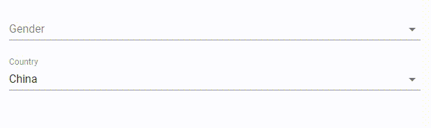

# FormikSelectField

## 道具 API

|名字|类型|默认|描述|
|---|---|---|---|
|name|`string`||选择框字段的名字，见formik文档 [field#name](https://jaredpalmer.com/formik/docs/api/field#name)|
|native|`bool`|`false`|是否使用原生下拉菜单|
|options|`array`||下拉菜单列表，每一项是一个形如`{ label: 'Male', value: 'male' }`的对象，`value`必须唯一|
|validate|`func`||验证函数，见formik文档 [field#validate](https://jaredpalmer.com/formik/docs/api/field#validate)|

其它道具将会传递到 [@material-ui/core/TextField](https://material-ui.com/api/text-field/) 组件

## Example

<p align="center">
  
</p>

```js
import React, { Component } from 'react';
import { Formik, Form } from 'formik';
import * as Yup from 'yup';
import { FormikSelectField } from 'formik-material-fields';

const validationSchema = Yup.object().shape({
  gender: Yup.string().required(),
  country: Yup.string().required(),
});

const initialValues = {
  gender: '',
  country: 0,
};

class MyForm extends Component {
  render() {
    return (
      <Formik
        initialValues={initialValues}
        validationSchema={validationSchema}
        onSubmit={this.props.onSubmit}
      >
        {({ isValid }) => (
          <Form autoComplete="off">
            <FormikSelectField
              name="gender"
              label="Gender"
              margin="normal"
              options={[
                { label: 'Male', value: 'male' },
                { label: 'Female', value: 'female' },
              ]}
              fullWidth
            />
            <FormikSelectField
              name="country"
              label="Country"
              margin="normal"
              options={[
                { label: 'China', value: 0 },
                { label: 'United States', value: 1 },
              ]}
              fullWidth
              native
            />
          </Form>
        )}
      </Formik>
    );
  }
}

```